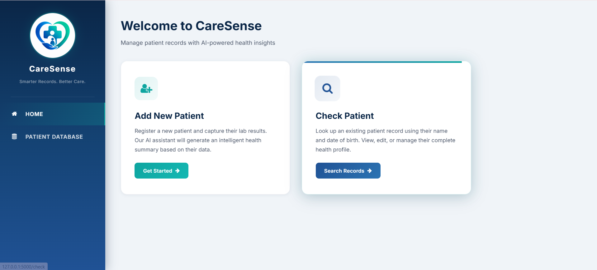
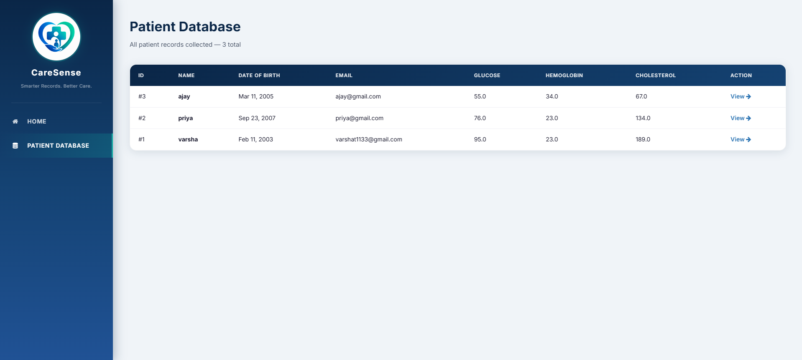

# 🏥 CareSense

**CareSense** is an AI-powered Patient Record Management System designed to streamline healthcare data management and improve clinical documentation. The application enables healthcare professionals to securely manage patient records, track laboratory results, and generate AI-assisted clinical remarks using a locally hosted Large Language Model (LLM).

---

## 📌 Overview

Managing patient information efficiently is critical in modern healthcare environments. CareSense provides a centralized platform for maintaining patient records while leveraging artificial intelligence to assist healthcare professionals with automated remark generation based on laboratory findings.

By utilizing a locally deployed AI model through Ollama, CareSense ensures data privacy while delivering intelligent healthcare insights.

---

## ✨ Features

* Patient registration and profile management
* Secure storage of patient medical records
* Laboratory test result management
* AI-generated clinical remarks
* Historical patient data tracking
* User-friendly web interface
* Local AI processing for enhanced privacy

---

## 🛠️ Technology Stack

| Category       | Technologies          |
| -------------- | --------------------- |
| Backend        | Python, Flask         |
| Frontend       | HTML, CSS, JavaScript |
| Database       | SQLite / MySQL        |
| AI Integration | Ollama, Llama 3.2     |

---

## 🚀 Installation

Clone the repository:

```bash
git clone https://github.com/your-username/CareSense.git
cd CareSense
```

Install dependencies:

```bash
pip install -r requirements.txt
```

Run the application:

```bash
python app.py
```

Access the application at:

```text
http://127.0.0.1:5000
```

---

## 📸 Screenshots

### Home Page




### Patient Records Dashboard



### AI-Generated Remarks


---


## 👩‍💻 Author

**Varsha T**

Master's Student in Data Science


---

⭐ If you found this project useful, consider giving it a star.
